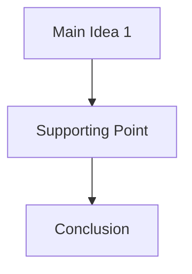

# WhisperScribe Plugin for Obsidian

Transcribe audio files directly in your Obsidian notes using Google Gemini or OpenAI.

## Features

- **Smart Model Selection** - Pre-configured cost-effective models with file size limits
- **Multiple AI Providers** - Google Gemini or OpenAI
- **Audio Support** - Transcribe audio files (MP3, WAV, OGG, M4A) up to model-specific limits
- **Intelligent Cost Optimization** - Recommended models prioritize cost-effectiveness
- **Custom Model Support** - Add your own models with custom file size limits
- **AI-Powered Features** (available on generalist models):
  - **Smart Summarization** - Short, Medium, Long, or Bullet Points formats
  - **Automatic Tagging** - Up to 5 relevant tags, properly formatted for Obsidian
  - **Visual Diagrams** - Mermaid flowcharts organizing main ideas
- **Smart Output Formatting** - Summary first, then transcription, followed by tags and diagrams
- **File Size Validation** - Prevents costly oversized uploads with model-specific limits

## Supported AI Providers

WhisperScribe supports either Google Gemini or OpenAI providers for comprehensive transcription and analysis.

### 🤖 Google Gemini
**Capabilities:** ✅ Transcription, ✅ Summarization, ✅ Tags, ✅ Diagrams  
**Available Models:** gemini-2.5-flash-lite (recommended), gemini-2.5-flash  
📚 [View all Gemini models](https://ai.google.dev/gemini-api/docs/models)  
*Note: Flash-Lite is the most cost-effective option for transcription tasks*

### 🤖 OpenAI
**Capabilities:** ✅ Transcription, ✅ Summarization, ✅ Tags, ✅ Diagrams  
**Popular Models:** o4-mini-2025-04-16 (recommended), whisper-1, gpt-4o-transcribe, gpt-4o-mini-transcribe  
📚 [View all OpenAI models](https://platform.openai.com/docs/models)  
*Note: o4-mini provides the best smart analysis at low cost*


## Installation

1. Clone or download this repository
2. Copy the plugin folder to your vault's `.obsidian/plugins/whisperscribe/` directory
3. Enable the plugin in Obsidian's Community Plugins settings

## Setup

1. **Open plugin settings** in Obsidian
2. **Select your preferred AI provider** from the dropdown
3. **Enter the required API key(s)** for your chosen provider
4. **Choose a model**:
   - **Recommended models** are pre-selected for cost-effectiveness
   - **Custom models** allow you to specify your own model name and file size limit
5. **Configure advanced features** (for generalist models):
   - **Summarization** - Choose length: Short, Medium, Long, or Bullet Points
   - **Tag Generation** - Automatic content categorization with Obsidian-compatible tags
   - **Diagram Generation** - Visual Mermaid flowcharts of main ideas

### Getting API Keys

- **Google Gemini**: Get from [Google AI Studio](https://aistudio.google.com/app/apikey)
- **OpenAI**: Get from [OpenAI Platform](https://platform.openai.com/api-keys)


## Usage

### Basic Usage

1. Add an audio file to your note using the standard Obsidian syntax:
   - `![[audio.ext]]` for audio files

2. Place your cursor on the line with the media file

3. Open the command palette (Ctrl/Cmd + P) and run:
   **"Transcribe audio with AI"

4. The transcription (and optional summary) will appear below the media file after processing


## Output Format

The output will be structured based on your settings:

```
## Summary
[AI-generated summary of the content]
OR
[• Bullet point 1
 • Bullet point 2
 • Bullet point 3...]

## Transcription
[Full transcription of the audio]

## Tags
#tag1 #tag2 #tag3 #tag4 #tag5

## Chart


When all optional features are disabled, only the transcription section will appear.

**Note:** Tags are automatically formatted for Obsidian compatibility:
- Spaces are replaced with hyphens (e.g., "White Cat" becomes "white-cat")
- All tags are converted to lowercase
- Special characters are removed
- Multiple words become hyphenated tags (e.g., #white-cat, #play)

## Requirements

- Obsidian v0.15.0 or higher
- API key for your chosen provider
- Internet connection for API calls

## Limitations

### File Size Limits (Model-Specific)
- **Google Gemini**: 20MB (Flash-Lite and Flash models)
- **OpenAI**: 25MB (all models including o4-mini)

### General Limitations
- **Audio quality** affects transcription accuracy
- **Processing time** varies by file size, model, and provider
- **Internet connection** required for all API calls

### Provider-Specific Requirements
- **Custom models**: User must specify accurate file size limits

### Model Capabilities
- **🤖 Smart Models** (Gemini, OpenAI o4-mini/GPT-4o):
  - ✅ Transcription + Summarization + Tags + Diagrams
  - 🧠 **Best choice** for smart analysis and comprehensive features
- **🎯 Audio-Only Models** (OpenAI Whisper):
  - ✅ Transcription only (advanced features auto-disabled)
  - 💰 **Best choice** for basic transcription at lowest cost

## Development

See [CONTRIBUTING.md](CONTRIBUTING.md) for local setup, build and test commands, commit standards, and PR guidelines.

## Manual Installation

1. Download `main.js`, `manifest.json`, and `styles.css` from the latest release
2. Create a new folder in your vault's `.obsidian/plugins/` directory called `whisperscribe`
3. Copy the downloaded files to this folder
4. Reload Obsidian
5. Enable the plugin in Settings > Community plugins

## Contributing

Contributions are welcome. Please read [CONTRIBUTING.md](CONTRIBUTING.md) before opening a pull request.

## License

This project is licensed under the MIT License - see the [LICENSE](LICENSE) file for details.
